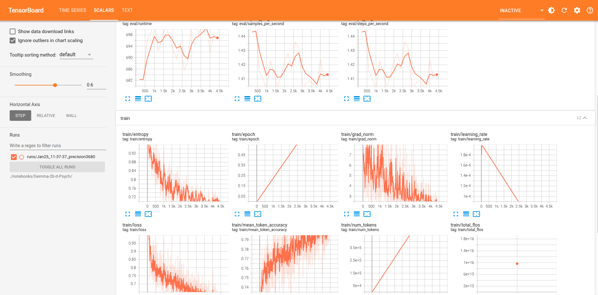

# LLM Fine-Tuning - Practical Example

## 📚 Project Overview

This repository presents a practical and educational example of fine-tuning a Large Language Model (LLM) using datasets structured in the instruction → input → output format 🤖➡️📄➡️✅.
The objective is to illustrate, in a clear and reproducible manner, the complete workflow required to adapt a pre-trained language model to a specific task or domain 🔬📊.

🎓 This project is intended for academic purposes, including learning, experimentation, and concept validation (proof of concept). It is not recommended for production use 🚫🏭.

## 🎯 Objective

- Demonstrate how to fine-tune a pre-trained LLM
- Explore the instruction tuning data format
- Apply modern techniques such as LoRA / QLoRA
- Evaluate how fine-tuning changes model behavior
- Serve as a baseline for experiments in different domains (e.g., healthcare, psychology, customer support)

## 🧠 Model Architecture and Training Setup

- Base model: google/gemma-2b-it
- Framework: Hugging Face Transformers
- Training backend: PyTorch
- Quantization: bitsandbytes (4-bit / 8-bit)

## 📊 Dataset

This work uses the [jkhedri/psychology-dataset](https://huggingface.co/datasets/jkhedri/psychology-dataset), a preference-based dataset containing paired psychological responses with contrasting interaction styles 🧠.

The dataset is shuffled at load time and supports a lightweight test mode via the DATA_SAMPLES parameter, enabling rapid validation prior to full-scale fine-tuning ⚡.

A standardized chat template is applied to all splits to match the target model’s conversational format. Only the empathetic and therapeutically appropriate responses (response_j) are selected for training, while judgmental or aggressive alternatives (response_k) are explicitly excluded 🚫.

This design ensures the model learns to produce safe, professional, and supportive psychological guidance.

## 🔧 Local Training Setup and Execution

To perform local fine-tuning, the project repository (**fine-tune-llm**) is accessed and the Python environment is initialized using [Poetry](https://python-poetry.org/) 📦.

The setup procedure consists of activating the virtual environment and installing all dependencies:

```bash
poetry shell && poetry install
```

The experiments are conducted using Jupyter notebooks, opened via VS Code 💻. The **notebooks/** directory contains inference and fine-tuning notebooks, as well as the output directory used during training:

- 01_GEMMA2B_QUICK_INFERENCE.ipynb
- 02_GEMMA2B_FINE_TUNING.ipynb
- Gemma-2b-it-Psych/ (training artifacts and logs)

This workflow enables reproducible local experimentation and model fine-tuning 🧪.

## 📊 Training Monitoring and Visualization 

**TensorBoard** is used to monitor training metrics in real time, enabling continuous inspection of the optimization process. This includes tracking the training loss, observing convergence behavior, and identifying potential instabilities during fine-tuning.

📈 Example TensorBoard Visualization

Below is an example of the training loss curve visualized using TensorBoard during the fine-tuning process:



Figure 1: Training loss monitored via TensorBoard during fine-tuning of the Gemma-2B model.

## 🧩 Training Metrics and Evaluation

During fine-tuning, both **training loss** and **evaluation loss** were monitored to assess convergence, generalization, and training stability.

- **Training loss** decreased smoothly from ~3.36 to ~0.55, indicating effective domain adaptation from the pre-trained checkpoint.
- **Evaluation loss** closely tracked the training loss, stabilizing in the range of 0.60–0.70, with no upward trend observed.
- The small gap between training and evaluation loss suggests good generalization and no evidence of overfitting.

### 📉 Loss Overview

| Metric | Value (approx.) |
| :--- | :--- |
| Final train loss | ~0.55 |
| Final eval loss | ~0.60–0.70 |

### 🔢 Perplexity (Derived Metric)

For autoregressive language models, perplexity is a more meaningful indicator of performance than traditional accuracy metrics. Perplexity is computed as the exponential of the cross-entropy loss:

$$Perplexity = \exp(\text{loss})$$

Based on the observed evaluation loss:

- Eval loss ≈ 0.60 → Perplexity ≈ 1.82
- Eval loss ≈ 0.70 → Perplexity ≈ 2.01

These values indicate that the model is highly confident in predicting the next token within the target domain, which is expected for a well-converged, domain-specific fine-tuning setup.

### 📊 Monitoring and Reproducibility

All metrics were logged using TensorBoard, allowing real-time inspection of training dynamics. Additionally, raw metric values were exported as CSV files for reproducibility and offline analysis:

- [train_loss.csv](metrics/eval_loss_runs_Jan25_11-37-37_precision3680.csv)
- [eval_loss.csv](metrics/train_loss_runs_Jan25_11-37-37_precision3680.csv)

This setup enables transparent evaluation and facilitates comparison across future experiments.

> While quantitative metrics indicate strong convergence, qualitative evaluation remains essential for assessing safety, empathy, and clinical appropriateness of generated responses.

## 🧬 Model Release Pipeline

This project produces multiple model artifacts corresponding to different stages of the fine-tuning and deployment pipeline.
Each repository serves a specific purpose and targets a distinct use case.

1️⃣ **Fine-Tuned Model (LoRA Adapters)**

Repository:

- 👉 [ecorbari/Gemma-2b-it-Psych](https://huggingface.co/ecorbari/Gemma-2b-it-Psych)

This repository contains the **fine-tuned LoRA adapters** trained on the psychology instruction dataset.

- Base model: google/gemma-2b-it
- Fine-tuning method: LoRA / QLoRA
- Format: PEFT adapters
- Intended use:
  - Research and experimentation
  - Further fine-tuning

> This repository does not include merged model weights and requires the base model to be loaded at inference time.

2️⃣ **Merged Model (Base + LoRA)**

Repository:

- 👉 [ecorbari/Gemma-2b-it-Psych-Merged](https://huggingface.co/ecorbari/Gemma-2b-it-Psych-Merged)

This repository contains the **merged model weights**, obtained by merging the **LoRA adapters** into the base **Gemma-2B** model.

- LoRA adapters merged into base weights
- No external adapters required at inference
- Fully self-contained Hugging Face model
- Intended use:
  - Standard Transformers inference
  - Evaluation and benchmarking
  - Downstream integration

> This variant simplifies deployment while preserving the fine-tuned behavior learned during adapter-based training.

3️⃣ **Quantized Model (GGUF)**

Repository:

- 👉 [ecorbari/Gemma-2b-it-Psych-GGUF](https://huggingface.co/ecorbari/Gemma-2b-it-Psych-GGUF)

This repository provides quantized GGUF variants of the merged model, optimized for efficient local inference.

- Format: GGUF
- Quantization levels: (e.g., Q4_K_M, Q5_K_M, Q8_0 - adjust if needed)
- Compatible with:
  - llama.cpp
  - ollama
  - other GGUF-based runtimes
- Intended use:
  - Local inference on CPU
  - Resource-constrained environments
  - Fast prototyping and demos
 
> This variant enables practical usage without requiring GPU acceleration.
